<p align="center">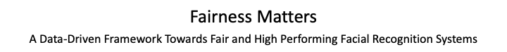</p>
<!-- <p align="center"></p> -->

<!-- &nbsp;&nbsp;&nbsp;&nbsp;&nbsp;&nbsp;&nbsp;&nbsp;&nbsp;&nbsp;&nbsp;&nbsp;&nbsp;&nbsp;&nbsp;&nbsp;&nbsp;&nbsp;&nbsp;

[](https://travis-ci.org/anfederico/Clairvoyant)

[](https://github.com/anfederico/Clairvoyant/issues)

[](https://opensource.org/licenses/MIT) -->

## Basic Overview
<p align="center">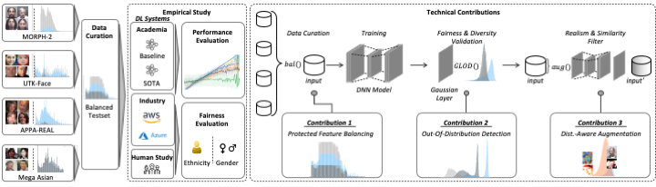</p>

<br>

## Data
In our whole procedure, we used 6 datasets in total. For pre-training, we used IMDB-WIKI dataset, which are separated into two subdatasets: WIKI and IMDB.
For analysis and curating our Balanced Dataset, UTK-Face, MOPRH-2, Megaage-Asian and APPA-REAL datasets are utilized.
For generalization test, FG-NET dataset is taken as a dataset from a total different distribution.
These datasets are downloaded or purchased via the following links:
- IMDB-WIKI: https://data.vision.ee.ethz.ch/cvl/rrothe/imdb-wiki/
- UTK-Face: https://data.vision.ee.ethz.ch/cvl/rrothe/imdb-wiki/
- MORPH-2: https://ebill.uncw.edu/C20231_ustores/web/product_detail.jsp?PRODUCTID=8 (Needs to be purchased)
- MegaAge-Asian: http://mmlab.ie.cuhk.edu.hk/projects/MegaAge/
- APPA-REAL: http://chalearnlap.cvc.uab.es/dataset/26/description/
- FG-NET: https://yanweifu.github.io/FG_NET_data/
After downloading these datasets, they are required to be moved to the ``./data`` folder extracted to their corresponding folders.

<br>

## Whole Procedure

#### Data pre-processing
After downloading and unzipping data in the ``./data`` folder, go into ``pre-processing`` folder and run the following code to construct Balanced Data.

```
python data_preprocess.py -dir <PATH_TO_DATA> -train_save_path <PATH_TO_TRAIN_DATA> -test_save_path <PATH_TO_TEST_DATA>
```
#### Training and Testing
When data is ready, run the ``train.py`` file to train the model and use the ``test.py`` file to test the model.

#### Data Augmentation and OOD_retrival
After training, run the file ``data_augmentation.py`` to do the augmentation and OOD selecting to get augmentated data.

#### Augmentated Data Training and Testing
Similarly, run the ``train.py`` and ``test.py`` to train and test the model on augmentated data.

## Results
Comparison of enhancement approach to SOTA and human perception:
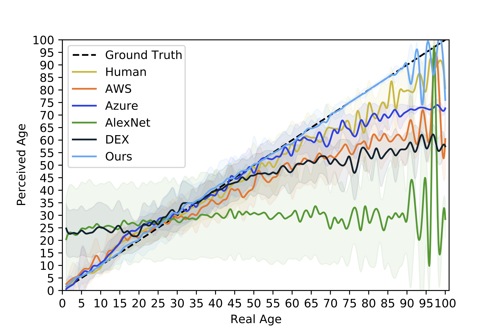

Ethnicity specific perception on SOTA

<table style="width:100%; table-layout:fixed;">
  <tr align='center'>
    <td>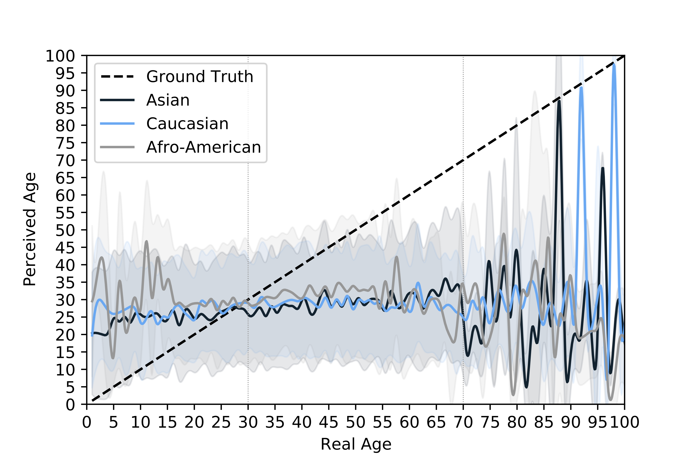</td>
    <td>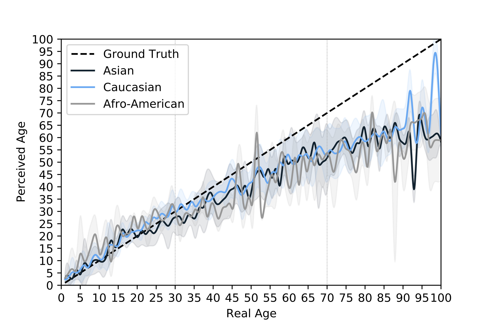</td>
    <td>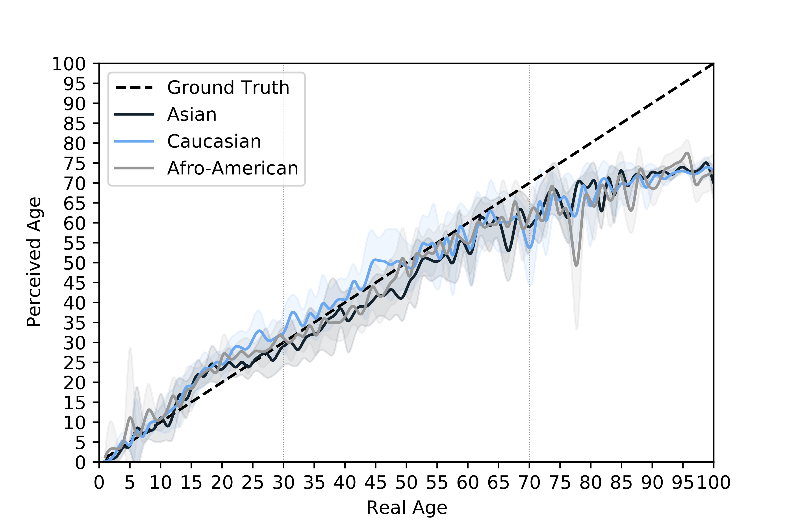</td>
  </tr>
  <tr align='center'>
    <td>AlexNet</td>
    <td>AWS</td>
    <td>Azure</td>
  </tr>
  <tr align='center'>
    <td>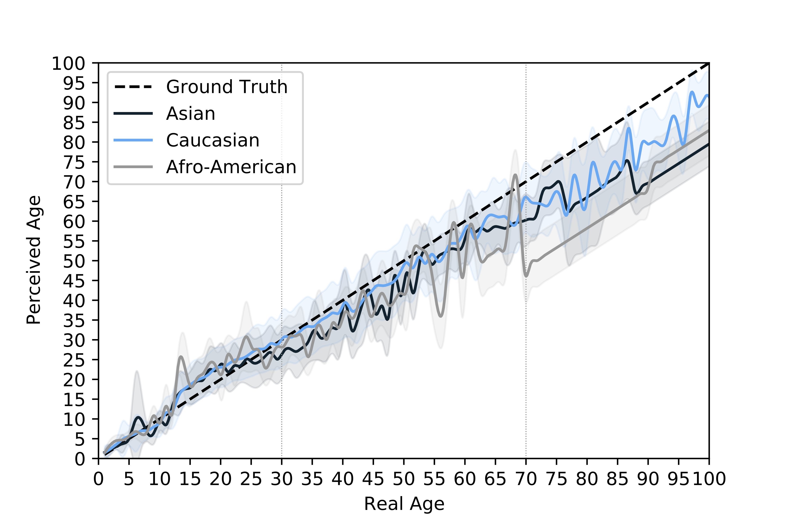</td>
    <td>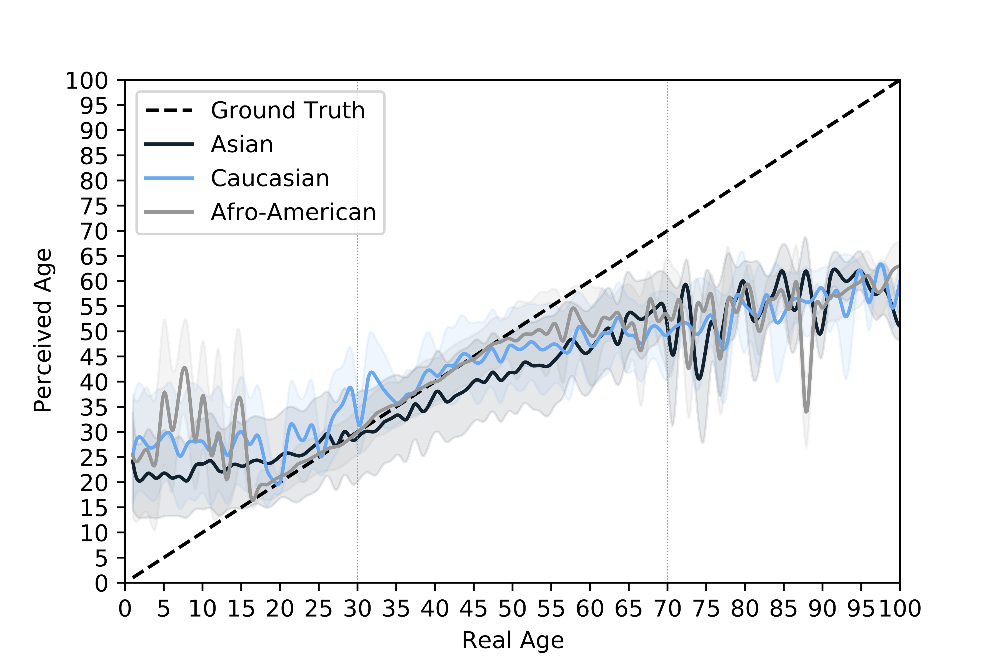</td>
    <td>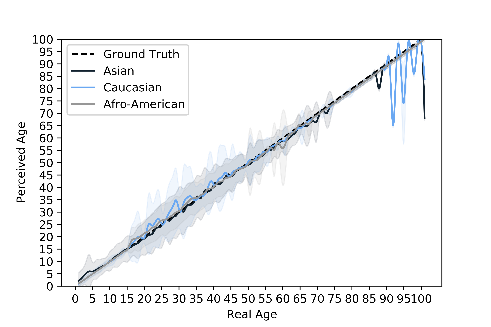</td>
  </tr>
  <tr align='center'>
    <td>Human</td>
    <td>DEX</td>
    <td>Ours</td>
  </tr>
</table>


OOD-Scores for Banalced DNN model:
<center>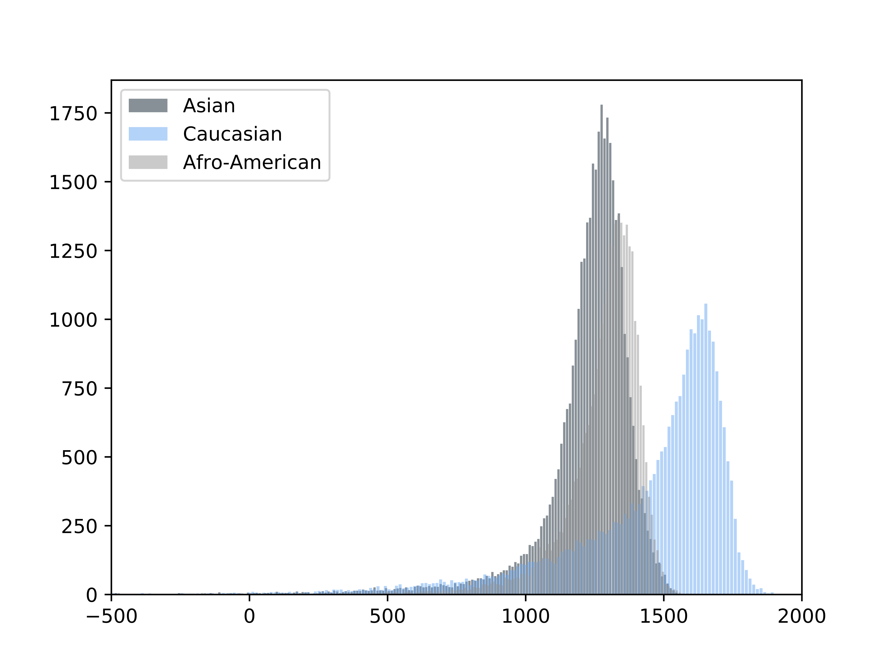</center>

Augmentation OOD-Scores
<center>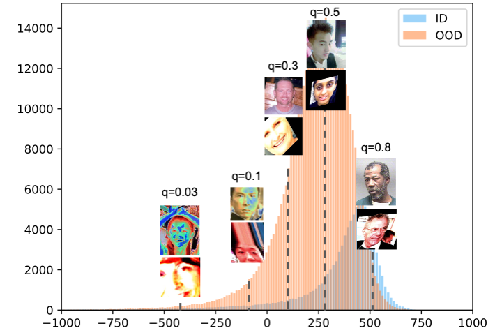</center>

Balanced testset evaluation on SOTA
<table>
    <tr align='center'>
        <td colspan='2'>DL System</td>
        <td>MAE</td>
        <td>Accuracy</td>
        <td>1-off Accuracy</td>
        <td>Perception Distance</td>
        <td>Fairness Score </td>
    </tr>
    <tr align='center'>
        <td rowspan='2'>Industry</td>
        <td>AWS</td>
        <td>10.57</td>
        <td>5.55%</td>
        <td>16.89%</td>
        <td>-7.68</td>
        <td>0.25 </td>
    </tr>
    <tr align='center'>
        <td>Azure</td>
        <td>6.39</td>
        <td>6.91%</td>
        <td>20.30%</td>
        <td>-2.45</td>
        <td>0.29 </td>
    </tr>
    <tr align='center'>
        <td rowspan='2'>Academia</td>
        <td>Baseline</td>
        <td>18.01</td>
        <td>2.21%</td>
        <td>6.31%</td>
        <td>-6.26</td>
        <td>0.32 </td>
    </tr>
    <tr align='center'>
        <td>DEX</td>
        <td>7.70</td>
        <td>6.17%</td>
        <td>20.07%</td>
        <td>0.78</td>
        <td>0.18</td>
    </tr>
    <tr align='center'>
        <td colspan='2'>Human Study</td>
        <td>5.26</td>
        <td>10.75%</td>
        <td>24.52%</td>
        <td>-0.10</td>
        <td>0.20 </td>
    </tr>
    <tr align='center'>
        <td colspan='2'>Ours</td>
        <td>3.39</td>
        <td>37.91%</td>
        <td>50.28%</td>
        <td>0.67</td>
        <td>0.89 </td>
    </tr>
</table>
