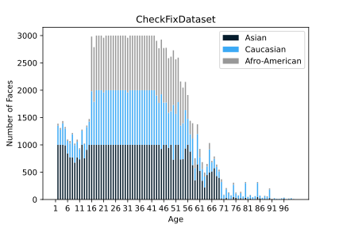

<p align="center"></p>
<!-- <p align="center"></p> -->

<!-- &nbsp;&nbsp;&nbsp;&nbsp;&nbsp;&nbsp;&nbsp;&nbsp;&nbsp;&nbsp;&nbsp;&nbsp;&nbsp;&nbsp;&nbsp;&nbsp;&nbsp;&nbsp;&nbsp;

[](https://travis-ci.org/anfederico/Clairvoyant)

[](https://github.com/anfederico/Clairvoyant/issues)

[](https://opensource.org/licenses/MIT) -->

## Basic Overview
<p align="center"></p>

<br>

## Data
In our whole procedure, we used 6 datasets in total. For pre-training, we used IMDB-WIKI dataset, which are separated into two subdatasets: WIKI and IMDB.
For analysis and curating our Balanced Dataset, UTK-Face, MOPRH-2, Megaage-Asian and APPA-REAL datasets are utilized.
For generalization test, FG-NET dataset is taken as a dataset from a total different distribution.
These datasets are downloaded or purchased via the following links:
- IMDB-WIKI: https://data.vision.ee.ethz.ch/cvl/rrothe/imdb-wiki/
- UTK-Face: https://data.vision.ee.ethz.ch/cvl/rrothe/imdb-wiki/
- MORPH-2: https://ebill.uncw.edu/C20231_ustores/web/product_detail.jsp?PRODUCTID=8 (Needs to be purchased)
- MegaAge-Asian: http://mmlab.ie.cuhk.edu.hk/projects/MegaAge/
- APPA-REAL: http://chalearnlap.cvc.uab.es/dataset/26/description/
- FG-NET: https://yanweifu.github.io/FG_NET_data/
After downloading these datasets, they are required to be moved to the ``./data`` folder extracted to their corresponding folders.

<br>

## Data pre-processing
After downloading and unzipping data in the ``./data`` folder, go into ``pre-processing`` folder and run the following code to construct Balanced Data.

```
python data_preprocess.py -dir <PATH_TO_DATA> -train_save_path <PATH_TO_TRAIN_DATA> -test_save_path <PATH_TO_TEST_DATA>
```
### Results
After balancing, the dataset has the following distribution:


## Training and Testing
When data is ready, run the ``train.py`` file to train the model and use the ``test.py`` file to test the model.

```
python train.py -datafolder <PATH_TO_DATA_FOLDER> -opt <OPT_METHOD> -train_path <PATH_TO_TRAIN_DATA> -test_path <PATH_TO_TEST_DATA> -model_name <MODEL_NAME> -dataset <DATASET_NAME> -num_epoches <num_epochs> -lr <LEARNING_RATE> -pretrained_model <PATH_TO_PRETRAINED_MODEL>
```

```
python test.py -test_path <PATH_TO_TEST_DATA> -result_folder <PATH_TO_SAVE_RESULTS> -trained_model <PATH_TO_TRAINED_MODEL> 
```
### Results
Comparison of enhancement approach to SOTA and human perception:


Ethnicity specific perception on SOTA

<table style="width:100%; table-layout:fixed;">
  <tr align='center'>
    <td></td>
    <td></td>
    <td></td>
  </tr>
  <tr align='center'>
    <td>AlexNet</td>
    <td>AWS</td>
    <td>Azure</td>
  </tr>
  <tr align='center'>
    <td></td>
    <td></td>
    <td></td>
  </tr>
  <tr align='center'>
    <td>Human</td>
    <td>DEX</td>
    <td>Ours</td>
  </tr>
</table>

Balanced testset evaluation on SOTA
<table>
    <tr align='center'>
        <td colspan='2'>DL System</td>
        <td>MAE</td>
        <td>Accuracy</td>
        <td>1-off Accuracy</td>
        <td>Perception Distance</td>
        <td>Fairness Score </td>
    </tr>
    <tr align='center'>
        <td rowspan='2'>Industry</td>
        <td>AWS</td>
        <td>10.57</td>
        <td>5.55%</td>
        <td>16.89%</td>
        <td>-7.68</td>
        <td>0.25 </td>
    </tr>
    <tr align='center'>
        <td>Azure</td>
        <td>6.39</td>
        <td>6.91%</td>
        <td>20.30%</td>
        <td>-2.45</td>
        <td>0.29 </td>
    </tr>
    <tr align='center'>
        <td rowspan='2'>Academia</td>
        <td>Baseline</td>
        <td>18.01</td>
        <td>2.21%</td>
        <td>6.31%</td>
        <td>-6.26</td>
        <td>0.32 </td>
    </tr>
    <tr align='center'>
        <td>DEX</td>
        <td>7.70</td>
        <td>6.17%</td>
        <td>20.07%</td>
        <td>0.78</td>
        <td>0.18</td>
    </tr>
    <tr align='center'>
        <td colspan='2'>Human Study</td>
        <td>5.26</td>
        <td>10.75%</td>
        <td>24.52%</td>
        <td>-0.10</td>
        <td>0.20 </td>
    </tr>
    <tr align='center'>
        <td colspan='2'>Ours</td>
        <td>3.39</td>
        <td>37.91%</td>
        <td>50.28%</td>
        <td>0.67</td>
        <td>0.89 </td>
    </tr>
</table>

## Data Augmentation and OOD_retrival
After training, runing the file ``data_augmentation.py`` to do the augmentation and OOD selecting to get augmentated data.

```
python data_augmentation -train_path <PATH_TO_TRAINING_DATA> -model_path <PATH_TO_TRAINED_MODEL> -in_path <PATH_TO_IN_DISTRIBUTION_DATA> -out_path <PATH_TO_OUT_OF_DISTRIBUTION_DATA> -batch_size <BATCH_SIZE> -quantile <QUANTILE_TO_SPLIT_DATA> -save_path <PATH_TO_SAVE_BALANCED_AUG_DATA> -aug_save_path <PATH_TO_SAVE_AUG_DATA>
```
### Results
OOD-Scores for Banalced DNN model:
<center></center>

Augmentation OOD-Scores
<center></center>


## Augmentated Data Training and Testing
Similarly, run the ``train.py`` and ``test.py`` to train and test the model on augmentated data.
```
python train.py -datafolder <PATH_TO_DATA_FOLDER> -opt <OPT_METHOD> -train_path <PATH_TO_TRAIN_DATA> -test_path <PATH_TO_TEST_DATA> -model_name <MODEL_NAME> -dataset <DATASET_NAME> -num_epoches <num_epochs> -lr <LEARNING_RATE> -trained_model <PATH_TO_PRETRAINED_MODEL>
```
### Results

<table class="tg">
<thead>
  <tr>
    <th class="tg-pb0m" rowspan="3"><span style="font-weight:bold">Testing Criteria</span></th>
    <th class="tg-fll5"><span style="font-weight:bold">Original</span></th>
    <th class="tg-bobw" colspan="2"><span style="font-weight:bold">Baseline</span></th>
    <th class="tg-bobw" colspan="2"><span style="font-weight:bold">Unrealistic Filter</span></th>
    <th class="tg-bobw" colspan="2"><span style="font-weight:bold">+ Similar Filter</span></th>
  </tr>
  <tr>
    <td class="tg-c3ow" rowspan="2">No Augment</td>
    <td class="tg-8d8j" colspan="2">OOD Area: 0-1</td>
    <td class="tg-8d8j" colspan="2">OOD Area: 0.03-1</td>
    <td class="tg-8d8j" colspan="2">OOD Area: 0.05-0.2</td>
  </tr>
  <tr>
    <td class="tg-8d8j">AutoAug</td>
    <td class="tg-8d8j">StandAug</td>
    <td class="tg-8d8j">AutoAug</td>
    <td class="tg-8d8j">StandAug</td>
    <td class="tg-8d8j">AutoAug</td>
    <td class="tg-8d8j">StandAug</td>
  </tr>
</thead>
<tbody>
  <tr>
    <td class="tg-amwm"><span style="font-weight:bold;font-style:normal">Performance</span></td>
    <td class="tg-8d8j">3.39</td>
    <td class="tg-8d8j">3.62</td>
    <td class="tg-bobw"><span style="font-weight:bold">3.64</span></td>
    <td class="tg-8d8j">3.66</td>
    <td class="tg-8d8j">3.7</td>
    <td class="tg-8d8j">3.64</td>
    <td class="tg-8d8j">3.74</td>
  </tr>
  <tr>
    <td class="tg-amwm"><span style="font-weight:bold;font-style:normal">Fairness</span><span style="font-style:normal">Fairness </span></td>
    <td class="tg-8d8j">0.88</td>
    <td class="tg-8d8j">0.85</td>
    <td class="tg-8d8j">0.81</td>
    <td class="tg-bobw"><span style="font-weight:bold">0.87</span></td>
    <td class="tg-8d8j">0.79</td>
    <td class="tg-8d8j">0.85</td>
    <td class="tg-8d8j">0.8</td>
  </tr>
  <tr>
    <td class="tg-amwm"><span style="font-weight:bold;font-style:normal">Generalization</span></td>
    <td class="tg-8d8j">7.55</td>
    <td class="tg-8d8j">6.84</td>
    <td class="tg-8d8j">6.93</td>
    <td class="tg-8d8j">6.57</td>
    <td class="tg-8d8j">6.55</td>
    <td class="tg-8d8j">6.57</td>
    <td class="tg-bobw"><span style="font-weight:bold">6.29</span></td>
  </tr>
</tbody>
</table>
