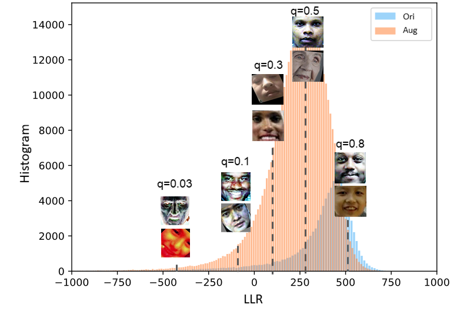

This is the official repository to our paper "Out-of-distribution detection and generalization to enhance fairness in age prediction". Currently available as preprint on https://arxiv.org/abs/2009.05283.

## Basic Overview

<p align="center"></p>

<br>

## Data
In our whole procedure, we used 6 datasets in total. For pre-training, we used IMDB-WIKI dataset, which are separated into two subdatasets: WIKI and IMDB.
For analysis and curating our Balanced Dataset, UTK-Face, MOPRH-2, Megaage-Asian and APPA-REAL datasets are utilized.
For generalization test, FG-NET dataset is taken as a dataset from a total different distribution.
These datasets are downloaded or purchased via the following links:
- IMDB-WIKI: https://data.vision.ee.ethz.ch/cvl/rrothe/imdb-wiki/
- UTK-Face: https://data.vision.ee.ethz.ch/cvl/rrothe/imdb-wiki/
- MORPH-2: https://ebill.uncw.edu/C20231_ustores/web/product_detail.jsp?PRODUCTID=8 (Needs to be purchased)
- MegaAge-Asian: http://mmlab.ie.cuhk.edu.hk/projects/MegaAge/
- APPA-REAL: http://chalearnlap.cvc.uab.es/dataset/26/description/
- The Asian Face Age Dataset (AFAD): https://afad-dataset.github.io/
- Cross-Age Celebrity Dataset (CACD): https://bcsiriuschen.github.io/CARC/
After downloading these datasets, they are required to be moved to the ``./data`` folder extracted to their corresponding folders.

<br>

## Data pre-processing
After downloading and unzipping data in the ``./data`` folder, go into ``pre-processing`` folder and run the following code to construct Balanced Data.

```
python data_preprocess.py -dir <PATH_TO_DATA> -train_save_path <PATH_TO_TRAIN_DATA> -test_save_path <PATH_TO_TEST_DATA>
```
### Results
After balancing, the dataset has the following distribution:


## Training and Testing
When data is ready, run the ``train.py`` file to train the model and use the ``test.py`` file to test the model.

```
python train.py -datafolder <PATH_TO_DATA_FOLDER> -opt <OPT_METHOD> -train_path <PATH_TO_TRAIN_DATA> -test_path <PATH_TO_TEST_DATA> -model_name <MODEL_NAME> -dataset <DATASET_NAME> -num_epoches <num_epochs> -lr <LEARNING_RATE> -pretrained_model <PATH_TO_PRETRAINED_MODEL>
```

```
python test.py -test_path <PATH_TO_TEST_DATA> -result_folder <PATH_TO_SAVE_RESULTS> -trained_model <PATH_TO_TRAINED_MODEL> 
```

## Data Augmentation and OOD_retrival
After training, runing the file ``data_augmentation.py`` to do the augmentation and OOD selecting to get augmentated data.

```
python data_augmentation -train_path <PATH_TO_TRAINING_DATA> -model_path <PATH_TO_TRAINED_MODEL> -in_path <PATH_TO_IN_DISTRIBUTION_DATA> -out_path <PATH_TO_OUT_OF_DISTRIBUTION_DATA> -batch_size <BATCH_SIZE> -quantile <QUANTILE_TO_SPLIT_DATA> -save_path <PATH_TO_SAVE_BALANCED_AUG_DATA> -aug_save_path <PATH_TO_SAVE_AUG_DATA>
```
### Results
OOD-Scores comparision for Unbalanced and Balanced DNN model:
<center></center>

Augmentation OOD-Scores
<center></center>


## Augmentated Data Training and Testing
Similarly, run the ``train.py`` and ``test.py`` to train and test the model on augmentated data.
```
python train.py -datafolder <PATH_TO_DATA_FOLDER> -opt <OPT_METHOD> -train_path <PATH_TO_TRAIN_DATA> -test_path <PATH_TO_TEST_DATA> -model_name <MODEL_NAME> -dataset <DATASET_NAME> -num_epoches <num_epochs> -lr <LEARNING_RATE> -trained_model <PATH_TO_PRETRAINED_MODEL>
```

